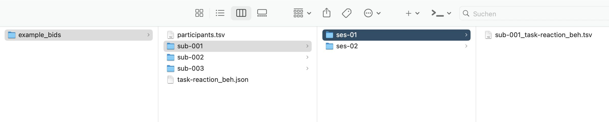

<!-- README.md is generated from README.Rmd. Please edit that file -->

```{r, include = FALSE}
knitr::opts_chunk$set(
  collapse = TRUE,
  comment = "#>",
  fig.path = "man/figures/README-",
  out.width = "100%"
)
```

# r2bids - Covert R data to BIDS format

<!-- badges: start -->
<!-- badges: end -->


This package provides functions for converting and storing data reprensented in R data frames in the convenient [BIDS format](https://bids.neuroimaging.io/).

The BIDS format is becoming increasingly popular in neuroscience as a means of storing data sets along with structured descriptions of samples, tasks, and variables. 

## Website
Read the detailed documentation including examples here...

[https://xaverfuchs.github.io/r2bids/](https://xaverfuchs.github.io/r2bids/)


## Installation
You can install the development version of *r2bids* from [GitHub](https://github.com/) with:
      
```{r}
# install.packages("devtools")
# devtools::install_github("xaverfuchs/r2bids")
```


## Example case

```{r}
library(r2bids)
```

### Generate some toy data
```{r}
example_data <- data.frame(
  ParticipantID = c(1, 2, 3, 1, 2, 3),
  Gender=c("M", "F", "O", "M", "F", "O"),
  Age=c(21, 32, 27, 21, 32, 27),
  Session = c(1, 1, 1, 2, 2, 2),
  ResponseTime = c(350, 400, 375, 415, 372, 401),
  Accuracy = c(1, 0, 1, 1, 1, 1)
)
```

### Validate the input data

This function does renaming of variables and labels to adhere to BIDS conventions. 
```{r}
example_data_checked <- check_input_data(data = example_data, 
                 participant_col = "ParticipantID", 
                 session_col = "Session", 
                 gender_col = "Gender")
```

### Write BIDS file

```{r}
write_bids(data = example_data_checked, output_dir = "./readme_files/example_bids", task_name = "reaction", participant_info_cols = c("age", "gender"), file_suffix = "beh")
```

### Define Metadata and write JSON file
```{r}
# Metadata for the example above with nested lists for each variable
meta_data <- list(
  participant_id = list(
    Description = "Unique participant identifier in the format sub-XXX.",
    Levels = list(
      "sub-001" = "Participant 1",
      "sub-002" = "Participant 2",
      "sub-003" = "Participant 3"
    )
  ),
  gender = list(
    Description = "Self-reported gender of the participant.",
    Levels = list(
      "m" = "Male",
      "f" = "Female",
      "o" = "Other"
    )
  ),
  age = list(
    Description = "Age of the participant in years.",
    Units = "years"
  ),
  session = list(
    Description = "Session identifier.",
    Levels = list(
      "ses-01" = "First session",
      "ses-02" = "Second session"
    )
  ),
  response_time = list(
    Description = "Response time of the participant in the task.",
    Units = "milliseconds"
  ),
  accuracy = list(
    Description = "Task accuracy (1 = correct, 0 = incorrect).",
    Levels = list(
      "0" = "Incorrect response",
      "1" = "Correct response"
    )
  )
)
```

```{r}
write_metadata(output_dir = "./readme_files/example_bids", task_name = "reaction", meta_data = meta_data)
```

The resulting output looks like that:


For more detailed example see the vignettes on the [package website](https://xaverfuchs.github.io/r2bids/)!
