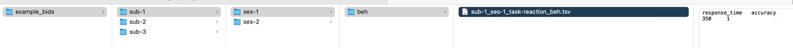

<!-- README.md is generated from README.Rmd. Please edit that file -->

# r2bids - Convert R data with behavioral data to BIDS behavioral format

<!-- badges: start -->
<!-- badges: end -->


This package provides functions for converting and storing behavioral
data represented in R data frames to the convenient [BIDS
format](https://bids.neuroimaging.io/). At present, this package is
suited to convert data from behavioral studies that are represented in a
trial structure (for example one trial per row). An event structure,
which is the common representation in BIDS, can be handled with some
workarounds in the current version and more dedicated functions dealing
with an event representation might be implemented in future releases.

The BIDS format is becoming increasingly popular in neuroscience as a
means of storing data sets along with structured descriptions of
samples, tasks, and variables.

## Website

Read the detailed documentation including examples here…

<https://xaverfuchs.github.io/r2bids/>

## Installation

You can install the development version of *r2bids* from
[GitHub](https://github.com/) with:

``` r
# install.packages("devtools")
# devtools::install_github("xaverfuchs/r2bids")
```

## General info and prerequisites

The package’s general workflow is like that:

1)  You collect data from all participants together in one single data
    frame that we refer to as the “task data”.
2)  You collect data describing your participants in another data frame
    that we refer to as the “participant data”.
3)  For both *task data* and *participant data* there are functions to
    check whether the variable names and entries of columns adhere to
    BIDS standards and to do convenient renaming of such within the data
    frames.
4)  View all used variables and labels using a view function for easy
    scripting
5)  Write meta data declaring all variables and entries that appear in
    the data
6)  Write a BIDS directors containing the task data, participant data,
    and meta data

The next sections will quickly demonstrate these steps.

## Example case

``` r
library(r2bids)
```

### Generate some toy task and participant data

``` r
example_task_data <- data.frame(
  ParticipantID = c(1, 2, 3, 1, 2, 3),
  Session = c(1, 1, 1, 2, 2, 2),
  ResponseTime = c(350, 400, 375, 415, 372, 401),
  Accuracy = c(1, 0, 1, 1, 1, 1)
)
```

``` r
example_participant_data <- data.frame(
  ParticipantID = c(1, 2, 3, 1, 2, 3),
  Sex=c("M", "F", "O", "M", "F", "O"),
  Age=c(21, 32, 27, 21, 32, 27)
)
```

### Check the task and participant data

This function does renaming of variables and labels to adhere to BIDS
conventions.

``` r
example_task_data_checked <- check_task_data(data = example_task_data, 
                 participant_col = "ParticipantID", 
                 session_col = "Session")
#> 
#> Step 1: checking variable labels in task data
#> 
#> Step 2: checking participant and session identifiers
#> renamed variable: ParticipantID -> participant_id
#> renamed ids to sub-1, sub-2, sub-3 ...
#> renamed variable: Session -> session
#> renamed sessions to ses-01, ses-02 ...
#> 
#> Step 3: checking if all variable names are snake_case
#> renamed variable: ResponseTime -> response_time
#> renamed variable: Accuracy -> accuracy
```

``` r
example_participant_data_checked <- check_participant_data(data = example_participant_data, 
                 participant_col = "ParticipantID", sex_col = "Sex", age_col = "Age")
#> 
#> Step 1: checking participant data
#> renamed variable: ParticipantID -> participant_id
#> renamed ids to sub-1, sub-2, sub-3 ...
#> renamed variable: Sex -> sex
#> 
#> Step 2: checking correct coding of sex variable
#> Warning in check_participant_data(data = example_participant_data,
#> participant_col = "ParticipantID", : Invalid values found in sex column. Please
#> recode to 'm', 'f', or 'o'.
#> renamed variable: Age -> age
#> 
#> Step 3: checking if all variable names are snake_case
```

Now we have nice data sets for both, except for the “sex” varibale, that
is not coded correcty and that we will fix manually.

``` r
example_participant_data_checked$sex <- tolower(example_participant_data_checked$sex)
```

### Inspect the data sets

Next we will check the data by printing information that needs to be
declared in the meta data.

``` r
print_data_structure(example_task_data_checked, example_participant_data_checked)
#> 
#> --- Dataset 1 ---
#> 
#> variable: participant_id 
#> Type: character 
#> Unique values: sub-1, sub-2, sub-3 
#> 
#> variable: session 
#> Type: character 
#> Unique values: ses-01, ses-02 
#> 
#> variable: response_time 
#> Type: numeric 
#> Range: 350 - 415 
#> 
#> variable: accuracy 
#> Type: numeric 
#> Range: 0 - 1 
#> 
#> --- Dataset 2 ---
#> 
#> variable: participant_id 
#> Type: character 
#> Unique values: sub-1, sub-2, sub-3 
#> 
#> variable: sex 
#> Type: character 
#> Unique values: m, f, o 
#> 
#> variable: age 
#> Type: numeric 
#> Range: 21 - 32
```

### Write the meta data

Fist create a meta data object…

``` r
meta_data <- create_meta_data()
```

Then we add variables, one by one…

``` r
#describe the first variable
meta_data <- add_meta_data(meta_data = meta_data, 
                           variable_name = "participant_id", 
                           Description = "Unique participant identifier in the format sub-X.",
                           Levels = list("sub-1" = "Participant 1", 
                                         "sub-2" = "Participant 2",
                                         "sub-3" = "Participant 3")
                           )

meta_data <- add_meta_data(meta_data = meta_data, 
                           variable_name = "sex", 
                           Description = "Self-reported sex of the participant.",
                           Levels = list("m" = "Male", "f" = "Female", "o" = "Other")
                           )

# ... and the next
meta_data <- add_meta_data(meta_data = meta_data, 
                           variable_name = "response_time", 
                           Description = "Response time of the participant in the task.",
                           Units = "milliseconds", 
                           Type="numeric")

# ... do this for all variables. Note that you can add as many fiels as you wish (here: Units, and Type)
```

Lets, have a look at the object

``` r
meta_data
#> $participant_id
#> $participant_id$Description
#> [1] "Unique participant identifier in the format sub-X."
#> 
#> $participant_id$Levels
#> $participant_id$Levels$`sub-1`
#> [1] "Participant 1"
#> 
#> $participant_id$Levels$`sub-2`
#> [1] "Participant 2"
#> 
#> $participant_id$Levels$`sub-3`
#> [1] "Participant 3"
#> 
#> 
#> 
#> $sex
#> $sex$Description
#> [1] "Self-reported sex of the participant."
#> 
#> $sex$Levels
#> $sex$Levels$m
#> [1] "Male"
#> 
#> $sex$Levels$f
#> [1] "Female"
#> 
#> $sex$Levels$o
#> [1] "Other"
#> 
#> 
#> 
#> $response_time
#> $response_time$Description
#> [1] "Response time of the participant in the task."
#> 
#> $response_time$Units
#> [1] "milliseconds"
#> 
#> $response_time$Type
#> [1] "numeric"
#> 
#> 
#> attr(,"class")
#> [1] "metadata"
```

As you can see, the meta data is nothing else than a list (with a class
“metadata”). If you feel comfortable with writing long lists, you can
also write the meta data without the “add_meta_data” function as a list
directly.

#### Check completeness of the meta data

Next, we should ensure that the variables declared in the meta data
match the ones in our data. There is a function to do that. It takes the
created meta data and as many data frames as you wish (the ones that you
use, i.e., task data and participant data).

``` r
check_meta_data(meta_data = meta_data, example_task_data_checked, example_participant_data_checked)
#> 🔍 Validating meta_data against data...
#> 
#> ✔ participant_id ...ok
#> ✔ sex ...ok
#> ✔ response_time ...ok
#> Warning in check_meta_data(meta_data = meta_data, example_task_data_checked, :
#> ⚠ Variable accuracy found in data but not declared in meta_data.
#> Warning in check_meta_data(meta_data = meta_data, example_task_data_checked, :
#> ⚠ Variable age found in data but not declared in meta_data.
```

### Write BIDS file

You should fix all these issues first, however, for demonstration
purposes, we will ignore them for now and move on to writing the BIDS
structure despite the unresolved issues…

#### Write task.tsv files

``` r
write_task_tsv(data = example_task_data_checked, bids_dir = "example_bids", 
               data_type = "beh", 
               filename_prefixes = c("sub-", "ses-", "task-"), 
               filename_variables = c("participant_id", "session", "reaction"="task"),
               path_prefixes = c("sub-", "ses-"), 
               path_variables = c("participant_id", "session"), 
               ignore_variables = c("age", "sex"))
#> Variable task does not exist in the data and will be imputed as reaction
#> Task data saved: example_bids/sub-1/ses-01/beh/sub-1_ses-01_task-reaction_beh.tsv
#> Task data saved: example_bids/sub-2/ses-01/beh/sub-2_ses-01_task-reaction_beh.tsv
#> Task data saved: example_bids/sub-3/ses-01/beh/sub-3_ses-01_task-reaction_beh.tsv
#> Task data saved: example_bids/sub-1/ses-02/beh/sub-1_ses-02_task-reaction_beh.tsv
#> Task data saved: example_bids/sub-2/ses-02/beh/sub-2_ses-02_task-reaction_beh.tsv
#> Task data saved: example_bids/sub-3/ses-02/beh/sub-3_ses-02_task-reaction_beh.tsv
```

#### Write participants.tsv files

``` r
write_participants_tsv(data = example_participant_data_checked,
                         bids_dir = "example_bids", include_variables = c("participant_id", "sex", "age"))
#> Participants data saved: example_bids/participants.tsv
```

Please note that this function can also be repurposed to write other
kinds of tsv files (like sessions.tsv).

#### Write the meta data

``` r
write_meta_data(meta_data = meta_data, bids_dir = "example_bids", task_name = "RT_Task")
#> Metadata JSON saved: example_bids/task-RT_Task_beh.json
```

#### Inspect the created BIDS directory

The resulting output looks like that:


### Load the data

You can also load data from a created BIDS directory into R. This is
also a great check whether things went wel…

``` r
example_data_imported <- read_bids(bids_dir = "example_bids")
#> Task data loaded from all task files.
#> Participants data loaded from: example_bids/participants.tsv
```

``` r
example_data_imported$task_data
#>   participant session response_time accuracy
#> 1       sub-1  ses-01           350        1
#> 2       sub-1  ses-02           415        1
#> 3       sub-2  ses-01           400        0
#> 4       sub-2  ses-02           372        1
#> 5       sub-3  ses-01           375        1
#> 6       sub-3  ses-02           401        1
```

``` r
example_data_imported$participants
#>   participant_id sex age
#> 1          sub-1   m  21
#> 2          sub-2   f  32
#> 3          sub-3   o  27
```

## More examples

For more detailed examples see the vignettes on the [package
website](https://xaverfuchs.github.io/r2bids/)!
